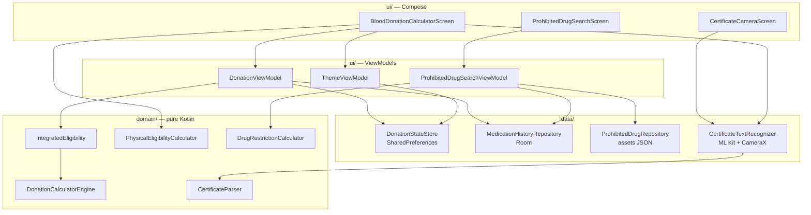
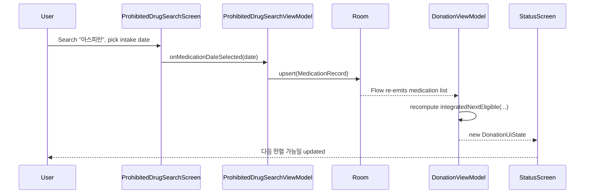
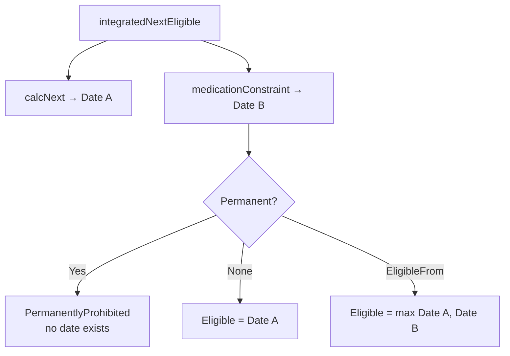
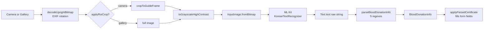

# 헌혈 가능일 계산기 — Technical Documentation

**Package:** `com.example.myapplication`
**Version:** 1.0 (versionCode 1)
**Platform:** Android (minSdk 24 / targetSdk 36 / compileSdk 36.1)
**Last updated:** 2026-09-21

---

## Table of Contents

1. [Overview](#1-overview)
2. [Overall App Architecture](#2-overall-app-architecture)
   - [2.1 Tech Stack](#21-tech-stack)
   - [2.2 Package Structure](#22-package-structure)
   - [2.3 Layer Model](#23-layer-model)
   - [2.4 Core Components](#24-core-components)
   - [2.5 State Management & Data Flow](#25-state-management--data-flow)
   - [2.6 Persistence Strategy](#26-persistence-strategy)
   - [2.7 Theming](#27-theming)
3. [Calculation Logic & Formulas](#3-calculation-logic--formulas)
   - [3.1 Domain Constants](#31-domain-constants)
   - [3.2 Physical Eligibility (Nadler's Formula)](#32-physical-eligibility-nadlers-formula)
   - [3.3 Donation Volume Resolution](#33-donation-volume-resolution)
   - [3.4 Next-Eligible-Date Algorithm](#34-next-eligible-date-algorithm)
   - [3.5 Medication Restriction Logic](#35-medication-restriction-logic)
   - [3.6 Integration of Both Histories](#36-integration-of-both-histories)
   - [3.7 Derived Display Values](#37-derived-display-values)
   - [3.8 Worked Examples](#38-worked-examples)
   - [3.9 Known Limitations](#39-known-limitations)
4. [OCR Implementation](#4-ocr-implementation)
   - [4.1 Pipeline Overview](#41-pipeline-overview)
   - [4.2 Image Acquisition](#42-image-acquisition)
   - [4.3 Preprocessing](#43-preprocessing)
   - [4.4 Text Recognition](#44-text-recognition)
   - [4.5 Field Extraction](#45-field-extraction)
   - [4.6 Applying Results to the Form](#46-applying-results-to-the-form)
   - [4.7 Error Handling & Transparency](#47-error-handling--transparency)
   - [4.8 Permissions & File Access](#48-permissions--file-access)
   - [4.9 Known Issues](#49-known-issues)
5. [Testing](#5-testing)
6. [Build & Configuration](#6-build--configuration)
7. [Appendix: File Map](#7-appendix-file-map)

---

## 1. Overview

헌혈 가능일 계산기 is an offline-first Android application that tells a blood donor **when they are next allowed to donate**. It reaches that answer by combining three independent constraint sources:

| Source | Question it answers |
|---|---|
| Donation history | Has enough time passed since the last donation? Are annual count / volume limits exhausted? |
| Medication history | Is the donor inside a drug-imposed restriction window? |
| Donor profile | Does the donor meet the age / weight / blood-volume criteria at all? |

A donor can enter donation records by hand, or **scan a 헌혈증서 (donation certificate)** with the device camera — on-device OCR extracts the donation type, date, certificate number, and blood center, and pre-fills the entry form.

All criteria are modeled on 대한적십자사 (Korean Red Cross) reference rules. Everything runs **entirely on-device**: there is no network permission, no backend, and no analytics.

---

## 2. Overall App Architecture

### 2.1 Tech Stack

| Concern | Choice | Version |
|---|---|---|
| Language | Kotlin | 2.2.10 |
| Build | Gradle (Kotlin DSL) + AGP | 9.4.0 |
| UI | Jetpack Compose + Material 3 | BOM 2026.02.01 |
| Architecture | MVVM (`AndroidViewModel` + `StateFlow`) | lifecycle 2.6.1 |
| Async | Kotlin Coroutines / Flow | (bundled) |
| Relational storage | Room + KSP | 2.8.5 |
| Key-value storage | SharedPreferences | platform |
| JSON | Gson | 2.11.0 |
| OCR | ML Kit Text Recognition v2 (Korean) | 16.0.1 |
| Camera | CameraX (core / camera2 / lifecycle / view) | 1.4.1 |
| Date/time | `java.time` via core library desugaring | desugar_jdk_libs 2.1.4 |
| Testing | JUnit 4, Compose UI Test, Espresso | — |

**Notable architectural decisions**

- **Single-module, single-Activity.** `MainActivity` is the only Activity; navigation is local Compose state, not Navigation-Compose.
- **No DI framework.** Dependencies are constructed manually. ViewModels expose a secondary `(Application)` constructor for `AndroidViewModelFactory` and a primary injectable constructor for tests.
- **Core library desugaring** is enabled so `java.time.LocalDate` works down to API 24. All date arithmetic uses `java.time`, never `Calendar`.
- **The domain layer is pure Kotlin.** Calculation code has no Android dependencies (except `androidx.compose.ui.graphics.Color` used as a presentation tag on reason/status objects), so the entire rules engine is testable on the JVM.

### 2.2 Package Structure

```
com.example.myapplication
├── MainActivity.kt                  Entry point, edge-to-edge + theme wiring
├── model/                           Plain data types (no logic beyond simple derivations)
│   ├── DonationType.kt              enum: volume + interval per type
│   ├── DonationRecord.kt            One donation event
│   ├── DonorProfile.kt              Physical profile + Sex enum
│   ├── MedicationRecord.kt          Room @Entity: one drug intake
│   ├── RestrictedDrug.kt            Catalog entry
│   └── ThemeMode.kt                 SYSTEM / LIGHT / DARK
├── domain/                          Pure calculation — the rules engine
│   ├── DonationCalculatorEngine.kt  Interval / annual count / annual volume rules
│   ├── PhysicalEligibilityCalculator.kt  Age / weight / Nadler blood volume
│   ├── DrugRestrictionCalculator.kt Drug catalog fallback + restriction math
│   ├── IntegratedEligibility.kt     Merges donation + medication constraints
│   └── CertificateParser.kt         OCR text → structured certificate fields
├── data/                            Persistence + device I/O
│   ├── DonationStateStore.kt        SharedPreferences (profile, records, theme)
│   ├── AppDatabase.kt               Room database singleton
│   ├── MedicationHistoryDao.kt      Room DAO
│   ├── MedicationHistoryRepository.kt
│   ├── LocalDateConverters.kt       Room TypeConverter (ISO-8601 text)
│   ├── ProhibitedDrugRepository.kt  Bundled JSON asset loader
│   └── CertificateTextRecognizer.kt OCR pipeline (CameraX output → ML Kit)
└── ui/                              Compose screens + ViewModels
    ├── BloodDonationCalculatorScreen.kt  Root screen, nav, all main composables
    ├── DonationViewModel.kt
    ├── ThemeViewModel.kt
    ├── ProhibitedDrugSearchScreen.kt / ...ViewModel.kt
    ├── MedicationHistoryCard.kt
    └── theme/                       Theme.kt, Color.kt, Type.kt
```

### 2.3 Layer Model



**Dependency direction is strictly downward.** `domain/` imports nothing from `ui/` or `data/`; `data/` imports `domain/` only where it must (the OCR recognizer calls the parser).

### 2.4 Core Components

#### `MainActivity`
Enables edge-to-edge, reads the persisted `ThemeMode` from `ThemeViewModel`, resolves it against `isSystemInDarkTheme()`, and re-applies `enableEdgeToEdge` whenever the resolved theme flips so system bar icons stay legible. Hosts exactly one composable: `BloodDonationCalculatorScreen`.

#### `DonationViewModel`
The application's primary state owner. It holds three `MutableStateFlow`s (profile, records, loading) and `combine`s them with the Room-backed medication `Flow` into a single `DonationUiState`. On every emission it recomputes `nextByType` — the integrated next-eligible date for all three donation types.

```kotlin
val uiState: StateFlow<DonationUiState> = combine(
    profile, records, medicationRepository.medications, isLoading
) { profile, records, medications, loading ->
    DonationUiState(
        /* ... */
        nextByType = DonationType.entries.associateWith { type ->
            integratedNextEligible(type, records, medications, today, profile.currentAge(today))
        }
    )
}.stateIn(viewModelScope, SharingStarted.WhileSubscribed(5_000), DonationUiState(today = today))
```

`today` is captured **once** at construction and reused, so D-day labels and the calendar do not shift mid-session.

#### `ProhibitedDrugSearchViewModel`
Loads the drug catalog (asset JSON, falling back to the compiled-in `PROHIBITED_DRUGS` list with a visible warning on failure), filters it by query, and — once the user picks an intake date — persists a `MedicationRecord` to Room. It tracks `savedRecordId` so re-picking a date for the same drug **updates** the existing row rather than accumulating duplicates.

#### `BloodDonationCalculatorScreen`
The root composable. Holds two pieces of navigation state:

- `selectedScreen: Screen` — `STATUS` (현황) / `INPUT` (헌혈 입력) / `MYPAGE` (마이페이지), rendered through a bottom nav bar.
- `formMode: RecordFormMode?` — `Add` or `Edit(record)`, which drives the `RecordFormDialog`.

#### `CertificateTextRecognizer`
The OCR pipeline. See [section 4](#4-ocr-implementation).

### 2.5 State Management & Data Flow

**Unidirectional.** Composables render `uiState` and emit events upward as lambdas; ViewModels mutate state and persist; new state flows back down.

The two ViewModels that write user data (`DonationViewModel`, `ProhibitedDrugSearchViewModel`) are **decoupled from each other** — they share no reference. Their integration point is the Room DAO's `Flow<List<MedicationRecord>>`:



Saving a drug on one screen updates the next-eligible date on another with no explicit wiring — the reactive DAO query is the only channel.

### 2.6 Persistence Strategy

Storage is split by shape, not by convenience:

| Data | Store | Format | Rationale |
|---|---|---|---|
| Donor profile | SharedPreferences (`donation_state`) | Typed keys | Small, flat, single-row |
| Donation records | SharedPreferences | Custom line/pipe-delimited text | Small list; predates Room in this codebase |
| Theme mode | SharedPreferences | Enum name | Must be readable **synchronously** on the first frame to avoid a launch flash |
| Medication history | Room (`donation.db`) | `medication_history` table | Needs reactive queries + ordering |
| Drug catalog | `assets/prohibited_drugs.json` | JSON array (14 entries) | Read-only reference data, updatable without code changes |

**Donation record encoding.** One record per line, fields joined with `|`, free text URL-encoded so it can never contain a delimiter:

```
id|TYPE|birthDate|date|certNumber|name|sex|centerName|donatedVolumeMl
```

`decodeRecords` splits with `limit = 9` and reads field 9 via `getOrNull`, so **8-field lines written before `donatedVolumeMl` was introduced still decode** (with a null volume) instead of being rejected. A malformed line is dropped rather than failing the whole load.

**Legacy migration.** `loadDonationRecords` checks for the modern `donation_records` key first. If absent, it reads the older per-type `state_<TYPE>` keys, expands them into `DonationRecord`s (filling name/birthDate/sex from the profile, which the old format did not store), writes the result back, and never runs again.

**Room configuration.** `LocalDate` is stored as ISO-8601 text via `LocalDateConverters`. This is deliberate: ISO dates sort lexicographically in chronological order, so `ORDER BY intakeDate DESC` is correct in SQL without a parallel numeric column.

**Catalog integrity.** `ProhibitedDrugRepository` deserializes into an all-nullable `ProhibitedDrugJson` shape first. Gson constructs objects through `Unsafe` rather than the constructor, so a field missing from the JSON would otherwise leave a non-null `String` property holding `null` and crash far from the parse site. `toModel()` is the single place that decides what a malformed entry means: entries without an ingredient name or restriction period are skipped; a payload that is not a JSON array, or that yields zero usable entries, throws `ProhibitedDrugDataException`.

### 2.7 Theming

The screen's colors do **not** come from `MaterialTheme`. `BloodDonationCalculatorScreen.kt` defines ~20 design tokens as `@Composable` properties reading a `staticCompositionLocalOf` named `LocalDarkTheme`:

```kotlin
internal val PageBg: Color
    @Composable get() = if (LocalDarkTheme.current) Color(0xFF0B1220) else Color(0xFFF8FAFC)
```

They read `LocalDarkTheme` rather than `isSystemInDarkTheme()` so an explicit in-app choice overrides the device setting. `MyApplicationTheme` is the only provider of `LocalDarkTheme`, which keeps the tokens and the Material color scheme from drifting apart.

`ThemeMode.forDarkSelection` means flipping the switch always commits to `LIGHT` or `DARK` — never back to `SYSTEM` — so the choice survives the device later switching itself.

---

## 3. Calculation Logic & Formulas

All logic in this section lives in `domain/` and is pure: same inputs → same outputs, no Android runtime, no I/O.

### 3.1 Domain Constants

**Per donation type** (`model/DonationType.kt`):

| Type | `defaultVolumeMl` | `minIntervalDays` | Annual count limit |
|---|---|---|---|
| `WHOLE_BLOOD` (전혈) | 430 | 56 | 5 |
| `PLASMA` (혈장성분) | 45 | 14 | none |
| `PLATELET` (혈소판성분) | 90 | 14 | 24 |

> `defaultVolumeMl` for the apheresis types is the volume counted toward the **annual cumulative-volume limit**, not the total fluid processed during the procedure.

**Global** (`domain/DonationCalculatorEngine.kt`, `domain/CertificateParser.kt`, `domain/PhysicalEligibilityCalculator.kt`):

| Constant | Value | Meaning |
|---|---|---|
| `ANNUAL_LIMIT_ML` | 2160 | Annual cumulative draw ceiling |
| `WHOLE_BLOOD_ANNUAL_LIMIT` | 5 | Max whole-blood donations per year |
| `PLATELET_ANNUAL_LIMIT` | 24 | Max platelet donations per year |
| `WHOLE_BLOOD_DIAGNOSTIC_DRAW_ML` | 30 | Extra draw for diagnostic testing (whole blood only) |
| `MIN_BLOOD_VOLUME_FOR_APHERESIS_ML` | 4000.0 | Minimum estimated blood volume for 성분헌혈 |
| Record expiry window | 366 days | Days after which a record releases its annual capacity |

### 3.2 Physical Eligibility (Nadler's Formula)

`checkPhysicalEligibility(profile, type)` screens the self-reported profile. It returns `PhysicalEligibility(isEligible, reasons)` — eligible only when `reasons` is empty.

**Age ranges (inclusive):**

| Type | Range |
|---|---|
| 전혈 | 16–69 |
| 혈장성분 | 17–69 |
| 혈소판성분 | 17–59 |

**Minimum weight:** male ≥ 50.0 kg, female ≥ 45.0 kg.

**Senior rule:** a donor aged ≥ 65 must have `donatedAge60To64 == true`. This check is an `else if` on the age-range branch, so an out-of-range age is reported once rather than double-counted (a 66-year-old requesting 혈소판성분, whose range tops out at 59, gets only the range message).

**Blood volume — Nadler's formula.** Applied only to apheresis types (`type != WHOLE_BLOOD`), with height `h` in **meters** and weight `w` in **kilograms**:

$$
\text{BV}_{\text{male}}(\text{L}) = 0.3669 \cdot h^{3} + 0.03219 \cdot w + 0.6041
$$

$$
\text{BV}_{\text{female}}(\text{L}) = 0.3561 \cdot h^{3} + 0.03308 \cdot w + 0.1833
$$

The result is multiplied by 1000 to get millilitres and compared against `MIN_BLOOD_VOLUME_FOR_APHERESIS_ML` (4000 mL).

```kotlin
private fun estimatedBloodVolumeMl(heightCm: Double, weightKg: Double, sex: Sex): Double {
    val heightM = heightCm / 100.0
    val liters = when (sex) {
        Sex.MALE   -> 0.3669 * heightM.pow(3) + 0.03219 * weightKg + 0.6041
        Sex.FEMALE -> 0.3561 * heightM.pow(3) + 0.03308 * weightKg + 0.1833
    }
    return liters * 1000.0
}
```

*Example:* 175 cm / 70 kg male → `0.3669 × 1.75³ + 0.03219 × 70 + 0.6041` = `1.9665 + 2.2533 + 0.6041` ≈ **4.824 L = 4824 mL** → passes.

> **Scope note.** This screens only the physical intake fields. Hemoglobin, blood pressure, recent illness, travel history and similar criteria are *not* modeled and must still be assessed at the donation center.

### 3.3 Donation Volume Resolution

The volume attributed to a record is resolved in priority order:

```kotlin
fun DonationRecord.volumeMl(): Int = donatedVolumeMl ?: actualVolumeMl(type, ageAtDonation())
```

1. **`donatedVolumeMl`** — the volume read off a scanned certificate (already including the +30 mL diagnostic draw). Authoritative when present.
2. **`actualVolumeMl(type, age)`** — the age-based default:

```kotlin
fun actualVolumeMl(type: DonationType, age: Int?): Int =
    if (type == DonationType.WHOLE_BLOOD && age != null && age in 16..17) 350
    else type.defaultVolumeMl
```

Donors aged 16–17 have 350 mL drawn for whole blood instead of 430 mL. `ageAtDonation()` uses `Period.between(birthDate, date).years` — the age **at the time of that donation**, not the current age.

**Diagnostic draw (certificate path only).** A certificate states the nominal volume; whole-blood donations draw 30 mL more for testing:

```kotlin
fun BloodDonationInfo.drawnVolumeMl(): Int? = statedVolumeMl()?.let { stated ->
    if (donationTypeEnum() == DonationType.WHOLE_BLOOD) stated + 30 else stated
}
```

So a certificate reading `전혈 400mL` yields `donatedVolumeMl = 430`.

### 3.4 Next-Eligible-Date Algorithm

`calcNext(type, records, today, donorAge, asOfDate)` returns `NextResult(nextDate, dday, reasons)`.

It starts at `nextDate = today` and pushes that date later through **three independent rules**, keeping the maximum. Each rule that is still in force also appends a human-readable `Reason`.

```
nextDate = max(today, intervalRule, annualCountRule, annualVolumeRule)
```

Only records dated at or before `asOfDate` are considered (`items = records.filter { !it.date.isAfter(asOfDate) }`), which is what makes back-dated entry validation correct — see below.

#### Rule 1 — Minimum interval (cross-type)

**Every past donation binds the next donation of *any* type, using its own interval.** A whole-blood donation imposes 56 days on a subsequent plasma donation; a plasma donation imposes 14 days on a subsequent whole-blood donation.

The binding record is the one whose release date is latest — not simply the most recent:

```kotlin
val binding = items.maxBy { it.date.plusDays(TYPE_INFO.getValue(it.type).gapDays.toLong()) }
val gapDate = binding.date.plusDays(bindingInfo.gapDays.toLong())
if (gapDate.isAfter(today)) nextDate = maxOf(nextDate, gapDate)
```

$$
\text{intervalDate} = \max_{r \in \text{records}} \left( r.\text{date} + \text{minIntervalDays}(r.\text{type}) \right)
$$

#### Rule 2 — Annual count limit

Applies to whole blood (5/yr) and platelet (24/yr); plasma has no count limit (`yearMax == null`).

```kotlin
if (yearMax != null && ofType.size >= yearMax) {
    val oldest = ofType.first()                    // records are date-ascending
    val expDate = oldest.date.plusDays(366)
    if (expDate.isAfter(today)) nextDate = maxOf(nextDate, expDate)
}
```

The model is that the oldest donation "expires" 366 days after it happened, freeing one slot.

#### Rule 3 — Annual cumulative volume

If adding the next donation would exceed 2,160 mL, walk records oldest-first, subtracting each, until enough capacity is freed — then wait for that record to expire:

```kotlin
if (totalVol + nextVolumeMl > ANNUAL_LIMIT_ML) {
    var runVol = totalVol
    for (h in items.sortedBy { it.date }) {
        runVol -= h.volumeMl()
        if (runVol + nextVolumeMl <= ANNUAL_LIMIT_ML) {
            val expDate = h.date.plusDays(366)
            if (expDate.isAfter(today)) nextDate = maxOf(nextDate, expDate)
            break
        }
    }
}
```

`nextVolumeMl` is `actualVolumeMl(type, donorAge)` — the volume the *upcoming* donation would draw.

#### `asOfDate` and back-dated entry

`earliestEligibleDate(type, records, ageAtDate, asOfDate)` reuses `calcNext` with `today = LocalDate.of(1, 1, 1)`:

```kotlin
private val DISTANT_PAST: LocalDate = LocalDate.of(1, 1, 1)

fun earliestEligibleDate(type, records, ageAtDate, asOfDate): LocalDate =
    calcNext(type, records, DISTANT_PAST, ageAtDate, asOfDate).nextDate
```

Passing a distant past as `today` removes the "at least today" floor, leaving only the constraint dates. This is what the record-entry form calls to validate a back-dated donation:

```kotlin
val otherRecords = records.filterNot { it.id == initial?.id }   // exclude the record being edited
val eligibleDate = earliestEligibleDate(t, otherRecords, null, dd)
if (dd.isBefore(eligibleDate)) restrictionError = "헌혈 제한기간이에요 (가능일: ${fmt(eligibleDate)})"
```

Because `calcNext` filters to `!it.date.isAfter(asOfDate)`, a donation dated *after* the one being inserted cannot retroactively block it — so back-filling an older donation after a newer one already exists works correctly.

### 3.5 Medication Restriction Logic

**Restriction period.** `restrictionDays` of `-1` is the sentinel for a lifetime ban:

```kotlin
val MedicationRecord.isPermanentlyRestricted: Boolean get() = restrictionDays < 0

val MedicationRecord.eligibleFrom: LocalDate?
    get() = if (isPermanentlyRestricted) null else intakeDate.plusDays(restrictionDays.toLong())
```

$$
\text{eligibleFrom} = \text{intakeDate} + \text{restrictionDays}
$$

Catalog entries range from 3 days (아스피린) to permanent (에트레티네이트, 사람뇌하수체 유래 성장호르몬).

**Snapshot semantics.** `restrictionDays` is **copied into the `MedicationRecord` at save time**, not looked up on read. A later edit to `prohibited_drugs.json` therefore cannot silently move a date the user has already been shown.

**Calendar arithmetic.** `addRestrictionPeriod` delegates to `LocalDate.plus`, which resolves calendar irregularities itself — adding months clamps to the shorter target month (Jan 31 + 1 month → Feb 28, or Feb 29 in a leap year), and adding days always lands on the correct date across leap years.

**Reducing the history to one constraint** (`medicationConstraint`):

1. If **any** record is permanent → `MedicationConstraint.Permanent`.
2. Otherwise take the record whose `eligibleFrom` is **latest** → `MedicationConstraint.EligibleFrom`.
3. If the history is empty → `MedicationConstraint.None`.

The binding entry is the one whose window *ends* last, deliberately **not** the most recent intake: 두타스테라이드 taken five months ago (180 days) outlasts 아스피린 taken yesterday (3 days). Taking the latest intake would under-report the wait.

### 3.6 Integration of Both Histories

`integratedNextEligible(type, records, medications, today, donorAge)` computes "Date A" from the donation history and "Date B" from the medication history and returns the later:

$$
\text{nextDate} = \max(\text{Date}_A,\ \text{Date}_B)
$$



A lifetime ban returns `IntegratedNextResult.PermanentlyProhibited` regardless of what the donation history says — no amount of waiting restores eligibility.

Reason chips follow `calcNext`'s convention: a medication window is listed **only while still in force** (`constraint.date.isAfter(today)`), so the UI shows active constraints rather than every drug ever recorded. Because `calcNext` already floors its answer at `today`, `maxOf` naturally discards an elapsed medication window.

### 3.7 Derived Display Values

**D-day** (`dday`) uses `ChronoUnit.DAYS.between(today, date)`:

| Condition | Label |
|---|---|
| `diff > 0` | `D-{n}` |
| `diff == 0` | `D-Day · 오늘!` |
| `diff < 0` | `이미 가능` |

**Cumulative volume status** (`statusStyle(pct)`), where `pct = totalVolume / 2160 × 100`:

| Percentage | Label | Color |
|---|---|---|
| ≤ 60 | 여유 | green `#059669` |
| ≤ 85 | 주의 | amber `#D97706` |
| < 100 | 임박 | orange `#EA580C` |
| ≥ 100 | 초과 | red `#E11D48` |

**Type subtitle** (`typeSubtitle`) renders as `1회 {volume}mL · 간격 {weeks}주 · {연 N회 | 횟수제한 없음}`, with weeks computed as `gapDays / 7` (integer division).

**Date formats:** `fmt` → `yyyy'년' M'월' d'일'`, `fmtShort` → `M'월' d'일'`.

### 3.8 Worked Examples

**Example 1 — cross-type interval**

Given a whole-blood donation on 2026-09-01 and today = 2026-09-21, asking for **plasma**:

- Rule 1: binding = 2026-09-01 whole blood → `2026-09-01 + 56` = **2026-10-27**. Note the 56-day whole-blood interval binds the plasma request, not plasma's own 14 days.
- Rules 2, 3: not triggered.
- Result: **2026-10-27**, `D-36`, reason `마지막 전혈헌혈 후 56일 간격 필요 (9월 1일)`.

**Example 2 — annual volume limit**

Five whole-blood donations at 430 mL each (total 2150 mL), most recent 2026-08-01, oldest 2026-01-10. Requesting whole blood, today = 2026-09-21:

- Rule 1: `2026-08-01 + 56` = 2026-09-26.
- Rule 2: `ofType.size (5) >= 5` → oldest is 2026-01-10 → `+366` = **2027-01-11**.
- Rule 3: `2150 + 430 = 2580 > 2160`. Subtract oldest (430) → `1720 + 430 = 2150 ≤ 2160` → break at 2026-01-10 → `+366` = **2027-01-11**.
- Result: **2027-01-11** (the maximum), with three reason chips.

**Example 3 — medication overrides donation history**

Donation history allows donating from 2026-09-26. 두타스테라이드 (180 days) taken 2026-06-01:

- Date A = 2026-09-26.
- Date B = `2026-06-01 + 180` = 2026-11-28.
- Result: **2026-11-28**, with a violet reason chip `두타스테라이드 복용 후 180일 제한 (6월 1일)`.

**Example 4 — 16-year-old donor**

Born 2010-03-01, donating whole blood on 2026-09-01 → age at donation 16 → `actualVolumeMl` returns **350 mL**, not 430. A scanned certificate stating `전혈 350mL` would set `donatedVolumeMl = 380` (350 + 30 diagnostic draw), which takes priority.

### 3.9 Known Limitations

These are current, verified behaviors of the implementation — documented so they are not mistaken for bugs in reading, and so they can be prioritized.

1. **The annual count rule only inspects the single oldest record of a type.**
   `calcNext` tests `ofType.size >= yearMax` against the *entire* history and then evaluates only `ofType.first()`. A donor with, say, ten lifetime whole-blood donations — five of them inside the last 12 months — will have `ofType.first()` point at a long-expired record, so `expDate.isAfter(today)` is false and **no constraint is applied**, even though the annual limit is genuinely exhausted. A correct implementation would count only records within the trailing 366 days and expire the oldest *of those*.
   *(Rule 3 does not have this problem: its oldest-first walk continues past expired records until enough capacity is freed, so the record it lands on is the right one.)*

2. **The cumulative-volume gauge shows a lifetime total, not a rolling year.**
   `CumulativeVolumeGauge` and `VolumeProgressBar` compute `records.sumOf { it.volumeMl() }` over all stored records with no date window, then display it against the 2,160 mL *annual* limit. A donor with several years of history will read as 초과 (over limit) while actually being eligible.

3. **Manually entered records carry no birth date.**
   `RecordFormDialog` does not collect one and passes `null` for age, so the 16–17-year-old reduced-volume rule cannot apply to hand-entered records. Scanned certificates are unaffected — `donatedVolumeMl` overrides the age path entirely.

4. **Expiry uses 366 days, not a calendar year.** This is intentionally conservative (one extra day) and consistent across rules 2 and 3.

5. **`checkPhysicalEligibility` is not part of the integrated calculation.** It is evaluated by the profile UI and reported separately; `integratedNextEligible` considers only donation and medication history.

---

## 4. OCR Implementation

The OCR feature lets a donor photograph a 헌혈증서 (donation certificate) and have the entry form filled in automatically. It is implemented across two files:

- **`data/CertificateTextRecognizer.kt`** — image acquisition, preprocessing, ML Kit invocation.
- **`domain/CertificateParser.kt`** — pure text → structured-field extraction.

### 4.1 Pipeline Overview



Entry point:

```kotlin
suspend fun recognizeCertificateInfo(
    context: Context,
    imageUri: Uri,
    applyRoiCrop: Boolean
): CertificateScanResult
```

It returns both the structured result and the raw recognized text:

```kotlin
data class CertificateScanResult(val rawText: String, val info: BloodDonationInfo)
```

`rawText` is retained deliberately — since the parser only ever reads label-adjacent text, the most useful diagnostic for "a field filled in wrong" is what OCR actually saw, not another guess at the regex.

### 4.2 Image Acquisition

Two sources, offered through a dropdown on the 스캔 button:

| Source | Launcher | `applyRoiCrop` |
|---|---|---|
| 촬영 (camera) | In-app `CertificateCameraScreen` (CameraX) | `true` |
| 갤러리에서 선택 | `ActivityResultContracts.PickVisualMedia` | `false` |

A gallery image has no guide frame to crop against, so ROI cropping is skipped for it.

**In-app camera** (`CertificateCameraScreen`). A full-screen `Dialog` hosting a CameraX `PreviewView` with `Preview` + `ImageCapture` bound to the composable's lifecycle, plus a white guide-frame overlay:

```kotlin
const val GUIDE_FRAME_WIDTH_FRACTION = 0.92f
const val GUIDE_FRAME_ASPECT_RATIO = 3f / 4f
```

The same two constants drive the on-screen border and the post-capture crop, so the guide is meant to be a promise about what will be cropped. (See [4.9](#49-known-issues) — the current binding does not fully keep that promise.)

`DisposableEffect` calls `cameraProvider.unbindAll()` when the screen leaves composition, so the camera hardware and its indicator are released on both the captured and cancelled paths.

**Capture output.** Photos are written to a cache subdirectory and exposed through a `FileProvider`:

```kotlin
fun createCertificatePhotoFile(context: Context): File {
    val dir = File(context.cacheDir, "certificate_photos").apply { mkdirs() }
    return File(dir, "certificate_${System.currentTimeMillis()}.jpg")
}
```

**EXIF normalization.** Before any pixel-based cropping, the bitmap is decoded and rotated upright per its EXIF orientation tag (90 / 180 / 270 handled; anything else treated as 0). This guarantees the crop operates on an upright image regardless of device orientation at capture.

**ROI crop.** `cropToGuideFrame` center-crops to the guide frame's width fraction and aspect ratio, clamping so the region never exceeds the bitmap bounds:

```kotlin
val frameWidth   = bitmap.width * GUIDE_FRAME_WIDTH_FRACTION
val frameHeight  = (frameWidth / GUIDE_FRAME_ASPECT_RATIO).coerceAtMost(bitmap.height.toFloat())
val clampedWidth = (frameHeight * GUIDE_FRAME_ASPECT_RATIO).coerceAtMost(bitmap.width.toFloat())
```

### 4.3 Preprocessing

The cropped region is converted to grayscale and contrast-boosted via a single combined `ColorMatrix`:

```kotlin
private fun toGrayscaleHighContrast(bitmap: Bitmap, contrast: Float = 2.2f): Bitmap {
    val translate = (-0.5f * contrast + 0.5f) * 255f
    // ... contrast matrix with `contrast` on the diagonal and `translate` in the offset column
    val colorMatrix = ColorMatrix().apply { setSaturation(0f) }
    colorMatrix.postConcat(contrastMatrix)
    // draw through a ColorMatrixColorFilter
}
```

Grayscale and contrast commute here because the luminance weights sum to 1, so one combined matrix is equivalent to applying either step first.

The transfer function is linear with clipping:

$$
v' = \text{clamp}\big(2.2\,v - 153,\ 0,\ 255\big)
$$

which maps everything below **v = 70** to pure black and everything above **v = 186** to pure white.

> **Caveat.** This is classical binarization-style preprocessing, which helps threshold-based engines but can work against a neural recognizer like ML Kit — hard clipping destroys thin Hangul strokes under uneven lighting. It is flagged in [4.9](#49-known-issues) as something to measure rather than assume.

### 4.4 Text Recognition

```kotlin
val image = InputImage.fromBitmap(processed, 0)
val recognizer = TextRecognition.getClient(KoreanTextRecognizerOptions.Builder().build())
return suspendCancellableCoroutine { continuation ->
    recognizer.process(image)
        .addOnSuccessListener { result ->
            continuation.resume(CertificateScanResult(result.text, parseBloodDonationInfo(result.text)))
        }
        .addOnFailureListener { error -> continuation.resumeWithException(error) }
}
```

- **Library:** `com.google.mlkit:text-recognition-korean:16.0.1` (ML Kit Text Recognition v2). The Korean model also recognizes Latin script, which the certificate needs for digits and `mL`.
- **Execution:** fully **on-device**. No network permission is declared; certificate images never leave the phone.
- **Bridging:** ML Kit's `Task` API is wrapped in `suspendCancellableCoroutine`, giving callers a plain `suspend` function.
- **Rotation:** `0` is passed to `InputImage.fromBitmap` because EXIF rotation was already baked into the bitmap.
- **Output consumed:** only `Text.text` — the flattened string. Block/line/element bounding boxes are available from ML Kit but are not currently used.

### 4.5 Field Extraction

`parseBloodDonationInfo(text)` is pure Kotlin — no Android types — and therefore fully unit-testable. It matches **five independent regexes**; each field is matched on its own and left `null` (never guessed) when its pattern is absent, because certificate layouts vary between blood centers.

```kotlin
data class BloodDonationInfo(
    val certNumber: String? = null,
    val donationType: String? = null,
    val donationDate: LocalDate? = null,
    val centerName: String? = null
)
```

| Field | Pattern | Matches | Example input → output |
|---|---|---|---|
| `certNumber` | `\d{2}-\d{2}-\d{6}-\d{2}` | Dash-separated certificate number | `증서번호 12-26-112916-01` → `"12-26-112916-01"` |
| `donationDate` | `헌혈일자?\D*(\d{4})\D+(\d{1,2})\D+(\d{1,2})` | Label + Y/M/D, any non-digit separators | `헌혈일자 2026. 7. 21.` → `LocalDate(2026,7,21)` |
| `donationType` | `헌혈종류\s*[:：]?\s*([^\n]+)` | Rest of the line after the label | `헌혈종류 전혈 400mL` → `"전혈 400mL"` |
| `centerName` | `[가-힣]+혈액원\s*\([\d\s-]+\)` | Center name with phone number | `대구경북혈액원(053 605 5662)` → full match |
| `statedVolumeMl` | `(\d+)\s*mL` | Applied to `donationType` only | `"전혈 400mL"` → `400` |

The `헌혈일자?` fragment makes the trailing 자 optional, so both `헌혈일` and `헌혈일자` labels match. `\D+` between components tolerates `.`, spaces, `-`, or `/` as separators. Date construction is guarded:

```kotlin
private fun MatchResult.toLocalDateOrNull(): LocalDate? {
    val (year, month, day) = destructured
    return runCatching { LocalDate.of(year.toInt(), month.toInt(), day.toInt()) }.getOrNull()
}
```

so an OCR misread producing month 13 yields `null` rather than throwing.

**Type mapping** is substring-based, tolerating surrounding noise:

```kotlin
fun BloodDonationInfo.donationTypeEnum(): DonationType? = when {
    donationType == null -> null
    donationType.contains("전혈")   -> DonationType.WHOLE_BLOOD
    donationType.contains("혈장")   -> DonationType.PLASMA
    donationType.contains("혈소판") -> DonationType.PLATELET
    else -> null
}
```

**Privacy boundary.** Only 헌혈종류 / 헌혈일 / 증서번호 / 헌혈장소 are extracted. 성명 and 생년월일 are deliberately **not** on `BloodDonationInfo` at all — OCR must never write into identity fields, which remain manual-entry only. A unit test asserts this contract.

### 4.6 Applying Results to the Form

`applyParsedCertificate(parsed)` in `RecordFormDialog` maps the parsed fields onto form state:

| Parsed field | Form target |
|---|---|
| `donationTypeEnum()` | 헌혈 종류 toggle |
| `donationDate` | 헌혈일 date field |
| `certNumber` | 헌혈증서번호 |
| `centerName` | 헌혈장소 |
| `drawnVolumeMl()` | `donatedVolumeMl` (hidden; feeds `volumeMl()`) |

Each successful assignment sets `appliedAny = true`; each miss appends a Korean label to `missingFields`.

Two behaviors are worth noting:

1. **Manually switching type invalidates the scanned volume.** `donatedVolumeMl` was computed for the previously detected type (including the whole-blood +30 mL draw), so changing the type by hand clears it:
   ```kotlin
   if (newType != type) donatedVolumeMl = null
   ```
2. **증서번호 and 헌혈장소 are hidden in the add form** (`if (initial != null)`), to keep the new-record form short. A scan still populates them silently, and they become visible and editable once the record exists.

The scanned record then flows into the same validation as a manual one — `earliestEligibleDate` rejects a date inside a restriction period before `onSave` is called.

### 4.7 Error Handling & Transparency

```kotlin
scanMessage = when {
    !appliedAny -> "인식된 정보가 없어요. 직접 입력해주세요"
    missingFields.isNotEmpty() -> "${missingFields.joinToString(", ")}은(는) 인식하지 못했어요. 확인 후 입력해주세요"
    else -> null
}
```

A field silently staying blank looks identical to a fully successful scan, so **partial success names the specific labels that failed** rather than reporting generic success.

| Failure | Handling |
|---|---|
| ML Kit throws / image undecodable | `runCatching` → `"이미지를 인식하지 못했어요. 다시 시도해주세요"` |
| No field matched | `"인식된 정보가 없어요. 직접 입력해주세요"` |
| Some fields matched | Names the missing labels |
| Camera permission denied | `"카메라 권한이 필요해요"` |
| CameraX bind failure | `"카메라를 열지 못했어요"` |
| `takePicture` failure | `"촬영에 실패했어요. 다시 시도해주세요"` |

**Raw-text inspector.** After every scan, an 인식된 원문 보기 ▼ toggle reveals the unmodified ML Kit output. Because `Text.text` is not necessarily in the order the certificate prints it, field values occasionally land in the wrong slot — this view exists so that mismatch is visible and reportable rather than silently guessed at. It is also the first diagnostic to check when tuning accuracy: garbled text points upstream (capture/preprocessing), correct text with empty fields points at the regexes.

### 4.8 Permissions & File Access

```xml
<uses-permission android:name="android.permission.CAMERA" />
<uses-feature android:name="android.hardware.camera.any" android:required="false" />
```

Camera permission is requested at the point of use via `ActivityResultContracts.RequestPermission`. Gallery selection uses the Photo Picker (`PickVisualMedia`), which requires **no** storage permission.

`FileProvider` is declared with authority `${applicationId}.fileprovider` and scoped by `res/xml/file_paths.xml` to exactly the cache subdirectory used for captures:

```xml
<paths>
    <cache-path name="certificate_photos" path="certificate_photos/" />
</paths>
```

**No `INTERNET` permission is declared** — the app cannot transmit certificate images or extracted data.

### 4.9 Known Issues

1. **The guide frame does not correspond to the cropped region.**
   `Preview` and `ImageCapture` are bound as independent use cases with no shared `ViewPort`, while `PreviewView` defaults to `FILL_CENTER` and fills a tall screen. The preview is therefore scaled up and side-cropped: the user sees only the middle slice of the sensor's field of view, but `cropToGuideFrame` cuts 92% of the *full captured* width. On a typical 1080×2340 screen with a 4:3 capture, the on-screen frame corresponds to roughly 60% of captured width — so the crop retains roughly 1.6× more area per axis than the user framed, leaving background clutter in the image and spending fewer pixels on the certificate.
   *Fix:* bind both use cases through a `UseCaseGroup` carrying `previewView.viewPort`, which makes CameraX apply the same crop rect to the saved JPEG.

2. **Contrast preprocessing is unvalidated and may reduce accuracy.** See [4.3](#43-preprocessing). Worth A/B-testing against the unprocessed crop — for example, running both and keeping whichever parses more fields.

3. **`ImageCapture` uses the default `CAPTURE_MODE_MINIMIZE_LATENCY`**, whose stronger noise reduction tends to smear fine print. `CAPTURE_MODE_MAXIMIZE_QUALITY` suits document capture better.

4. **No focus control.** There is no tap-to-focus and no focus request before `takePicture`, so nothing guarantees the certificate is in focus — blur is the most common cause of garbled document OCR.

5. **Flattened text loses layout.** Only `Text.text` is consumed, so label→value association relies on the recognizer emitting them adjacently. Pairing labels to values by bounding-box proximity (`Text.textBlocks` → lines → `boundingBox`) would be robust to column interleaving.

6. **Exact-literal matching is brittle to OCR noise.** `CERT_NUMBER_REGEX` requires ASCII hyphens; an en-dash or space misread breaks the match. Normalizing dash variants and whitespace before matching would recover these.

7. **No accuracy regression suite.** Parser tests run against hand-written strings; there is no fixture set of real certificate photos, so image-path changes cannot be measured. Adding sample images under `androidTest/assets` plus an instrumented test asserting field-extraction rate would make accuracy work measurable.

---

## 5. Testing

**Current status: 69 JVM unit tests, 0 failures** (`./gradlew testDebugUnitTest`).

| Suite | Tests | Covers |
|---|---|---|
| `CertificateParserTest` | 18 | All five regexes, volume/diagnostic-draw math, type→enum mapping, the name/birth-date exclusion contract, empty and unrecognized input |
| `IntegratedEligibilityTest` | 13 | Constraint reduction, binding-entry selection, permanent bans, donation-vs-medication precedence, reason surfacing |
| `DrugRestrictionCalculatorTest` | 11 | Calendar arithmetic across month/leap boundaries, permanent sentinel, search matching, catalog duplicate check |
| `ProhibitedDrugRepositoryTest` | 9 | JSON parsing, malformed-entry tolerance, error cases, bundled-asset integrity vs the compiled-in fallback |
| `DonationCalculatorEngineTest` | 8 | Volume resolution priority, `asOfDate` filtering for back-dated inserts |
| `PhysicalEligibilityCalculatorTest` | 5 | Senior (65+) rule, age-range interaction |
| `ThemeModeTest` | 4 | Mode resolution and toggle semantics |

The seven suites above account for 68 tests; the 69th is the generated `ExampleUnitTest` placeholder.

Instrumented tests: `ProfileNameInputTest` (Compose UI).

Notably, `ProhibitedDrugRepositoryTest` asserts that **the bundled `prohibited_drugs.json` agrees with the compiled-in `PROHIBITED_DRUGS` fallback on the calculation fields**, so the two data sources cannot silently diverge.

**Coverage gaps:** the annual count/volume rules in `calcNext` (see [3.9](#39-known-limitations) item 1), and the entire image pipeline in `CertificateTextRecognizer`.

**Commands**

```bash
./gradlew testDebugUnitTest        # JVM unit tests
./gradlew connectedDebugAndroidTest # instrumented (device/emulator required)
./gradlew assembleDebug            # build
```

---

## 6. Build & Configuration

- **Version catalog.** All dependency coordinates live in `gradle/libs.versions.toml`; no hardcoded versions in build files.
- **KSP** (not KAPT) generates Room code.
- **Core library desugaring** is required — `java.time` is used throughout and `minSdk` is 24.
- **Release build.** `optimization { enable = false }` — R8/ProGuard is currently **disabled** for release. Enabling it will require keep rules for Room entities and Gson-deserialized models (`ProhibitedDrugJson` is reflectively constructed).
- **`exportSchema = false`** on the Room database. Schema export should be enabled before shipping a version 2 migration.

---

## 7. Appendix: File Map

| File | Responsibility |
|---|---|
| `MainActivity.kt` | Entry point; edge-to-edge, theme resolution |
| `model/DonationType.kt` | Per-type volume + interval constants |
| `model/DonationRecord.kt` | One donation event |
| `model/DonorProfile.kt` | Physical profile, `currentAge()` |
| `model/MedicationRecord.kt` | Room entity, `eligibleFrom`, permanent sentinel |
| `model/RestrictedDrug.kt` | Drug catalog entry |
| `model/ThemeMode.kt` | Theme preference resolution |
| `domain/DonationCalculatorEngine.kt` | Interval / annual count / annual volume rules, `earliestEligibleDate` |
| `domain/PhysicalEligibilityCalculator.kt` | Age/weight ranges, Nadler's formula |
| `domain/DrugRestrictionCalculator.kt` | Fallback catalog, restriction date math, search |
| `domain/IntegratedEligibility.kt` | Merges donation + medication constraints |
| `domain/CertificateParser.kt` | OCR text → `BloodDonationInfo` |
| `data/DonationStateStore.kt` | SharedPreferences persistence + legacy migration |
| `data/AppDatabase.kt` | Room singleton |
| `data/MedicationHistoryDao.kt` | Reactive medication queries |
| `data/MedicationHistoryRepository.kt` | DAO wrapper |
| `data/LocalDateConverters.kt` | `LocalDate` ↔ ISO-8601 text |
| `data/ProhibitedDrugRepository.kt` | Asset JSON loading, validation, caching |
| `data/CertificateTextRecognizer.kt` | EXIF/crop/preprocess + ML Kit invocation |
| `ui/BloodDonationCalculatorScreen.kt` | Root screen, navigation, design tokens, all main composables, camera screen |
| `ui/DonationViewModel.kt` | Primary state owner |
| `ui/ProhibitedDrugSearchScreen.kt` / `...ViewModel.kt` | Drug search + intake recording |
| `ui/MedicationHistoryCard.kt` | Saved medication list |
| `ui/theme/` | `LocalDarkTheme`, Material color schemes, typography |
| `assets/prohibited_drugs.json` | 14-entry drug catalog |
| `res/xml/file_paths.xml` | FileProvider scope for certificate photos |
